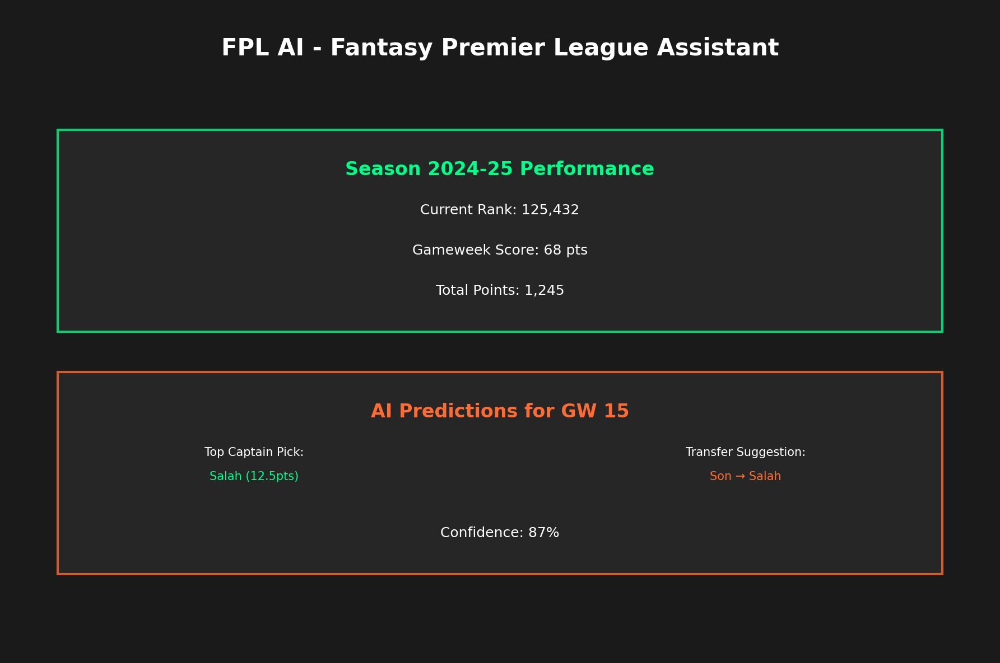

# ⚽ Dep La: An AI for Fantasy Premier League
Dep La is an AI system built to predict [Fantasy Premier League](https://fantasy.premierleague.com/) points, and optimize Fantasy Premier League teams. This project uses machine learning algorithms to analyze past data and predict future player performance. The goal here is to build a system that outperforms *most* human FPL players. 

> [!NOTE]
> Dep La is live for the 2024-25 season! Keep track of its performance [here](https://fantasy.premierleague.com/entry/3291882/event/1). This will its first season of FPL, so if it flops, please be kind :)

## 📸 Screenshots

## Approach
There are four main steps Dep La uses to optimize a team: 

1. **Collect data**: The first step is to collect *raw* data for both players and teams. This data is collected from multiple sources and stored at [this repository](https://github.com/kz4killua/fpl-ai-data). 
2. **Engineer features**: Now we have raw data. We can use this to extract interesting machine learning features. Which players are in great form? How well is each team playing? How well does each player perform at home vs away? 
3. **Make predictions**: The next step is to predict how many points each player will score in their next matches. We do this using *scikit-learn*.
4. **Optimize the team**: Predicting points is only half the story. We also need to figure out which players to buy, which ones to sell, who to captain, who to start, who to bench, etc.

After these steps, you should be presented with a killer FPL team!

## Getting Started
1. Make sure [Python 3](https://www.python.org/) is installed on your target machine. 
2. Install the project requirements. (We recommend doing this in a virtual environment.) The requirements are listed in `requirements.txt`. To install these, open up a terminal and run `pip install -r requirements.txt`. If you are working with a Linux machine, you may need to instead run `pip3 install -r requirements.txt`. 
3. Run `setup.sh` to download data and other requirements for the application. 
4. Set up environment variables. Please refer to `.env.example` for more details. The environment variables will be automatically loaded up from any detected `.env` file in the root of the project. 
5. Run all cells in `main.ipynb`. We have opted to use a Jupyter notebook as the code's entrypoint rather than a *.py* file. Often after running the code, the user may want to more closely inspect predictions, player data, etc. A notebook is more convenient in this case. 

## Current Limitations
- Only Premier League data is used for training and inference. There is no data from any other leagues or competitions. If Erling Haaland scores a hat-trick in a UCL match, Dep La wouldn't know. 
- No training data was collected for events before the 2016-17 Premier League season.
- While extensive simulations have been run for previous seasons, Dep La is only in its first season of real-world FPL. For that reason, we consider it bleeding edge. 

## Related
- [fpl-ai-data](https://github.com/kz4killua/fpl-ai-data) - Training data for Dep La
